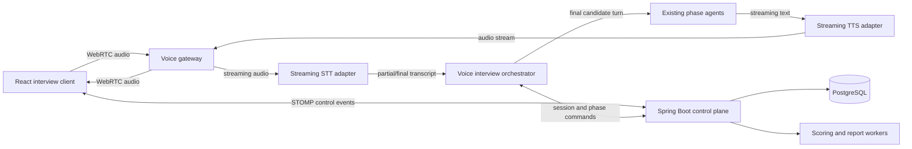
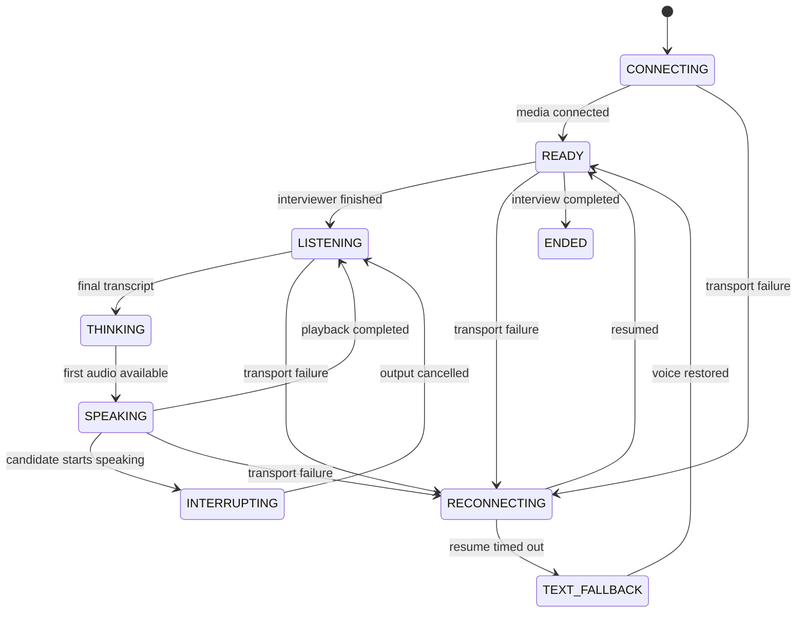

# MockMate Real-Time Voice Interview Architecture

## 1. Goal

Convert MockMate from a text interview with browser speech helpers into a real-time,
interruptible voice interview while preserving the existing:

- interview phases and timers;
- resume-aware AI agents;
- DSA editor and code feedback;
- PostgreSQL transcript and scoring flow;
- text chat as an accessibility and recovery fallback.

The target experience is a continuous conversation: the candidate speaks, sees a
live transcript, hears the interviewer quickly, and can interrupt the interviewer
without waiting for the full response to finish.

## 2. Current Architecture and Its Limits

Today, voice is only a wrapper around text:

1. `useVoiceInput.ts` uses the browser `SpeechRecognition` API.
2. The final text is manually submitted over STOMP.
3. `InterviewWebSocketController` calls `ChatService.processMessage`.
4. The complete AI text response is sent back over STOMP.
5. `useVoiceOutput.ts` reads that text with browser `speechSynthesis`.

This works as a prototype, but it is not a real-time voice system because:

- browser STT/TTS quality and support vary by browser and operating system;
- audio is not streamed to the application;
- the AI response is produced as one blocking text result;
- there are no partial transcripts, voice activity events, or audio chunks;
- there is no barge-in/interruption handling;
- STOMP and the in-memory simple broker are suitable for control events, not
  low-latency binary media;
- `InterviewRoomPage`, `ChatPanel`, and `DsaPanel` can each create a separate
  STOMP connection through `useWebSocket`;
- `CompletableFuture.runAsync` uses an unmanaged common pool for code feedback.

## 3. Recommended Architecture

Use two paths with different responsibilities.



### Control plane: existing Spring Boot application

The control plane remains the source of truth for:

- authentication and authorization;
- interview creation, start, phase transition, and completion;
- timers and DSA events;
- canonical transcript persistence;
- scoring, reports, analytics, and audit records;
- issuing short-lived credentials for the media connection.

Continue using STOMP initially for low-frequency JSON events. Replace the simple
broker with a broker relay or another shared event transport before running
multiple backend instances.

### Media plane: voice gateway

The media plane handles:

- microphone audio ingestion;
- audio format normalization;
- voice activity detection (VAD);
- streaming STT;
- streaming TTS;
- playback buffering;
- interruption/barge-in;
- media connection health and latency metrics.

Use WebRTC between the browser and voice gateway. WebRTC provides jitter
buffering, congestion handling, echo cancellation support, and a natural path
for full-duplex audio. Do not send continuous audio as base64 STOMP messages.

The first implementation can be a `voice-gateway` module deployed beside the
Spring application. Keep it behind provider interfaces so it can later become an
independently scaled service without changing interview-domain code.

## 4. Backend Component Boundaries

```text
com.mockmate
├── interview
│   ├── application
│   │   ├── InterviewOrchestrator
│   │   ├── InterviewTurnService
│   │   └── PhaseTransitionService
│   └── domain
│       ├── InterviewState
│       ├── InterviewTurn
│       └── InterviewEvent
├── voice
│   ├── api
│   │   ├── VoiceSessionController
│   │   └── VoiceEventController
│   ├── application
│   │   ├── VoiceSessionService
│   │   ├── VoiceTurnCoordinator
│   │   └── BargeInService
│   ├── port
│   │   ├── SpeechToTextPort
│   │   ├── TextToSpeechPort
│   │   ├── RealtimeConversationPort
│   │   └── VoiceTransportPort
│   └── infrastructure
│       ├── stt
│       ├── tts
│       └── webrtc
└── transcript
    ├── TranscriptService
    └── TranscriptRepository
```

Key rule: voice transport code must not call repositories or phase agents
directly. It emits normalized events to `VoiceTurnCoordinator`, which invokes
the interview application layer.

## 5. Conversation State Machine

Each active voice session has an explicit state.



Only a final STT transcript creates a candidate interview turn. Partial
transcripts are ephemeral UI events and must not be added to AI memory or scored.

Every turn has a client-generated `turnId`. Commands and events also carry a
monotonic `sequence` number. This makes reconnects idempotent and prevents a
duplicated final transcript from producing two AI answers.

## 6. Event Contract

Use one envelope for control and voice-domain events:

```json
{
  "eventId": "uuid",
  "sessionId": 42,
  "voiceSessionId": "uuid",
  "turnId": "uuid",
  "sequence": 18,
  "type": "TRANSCRIPT_FINAL",
  "timestamp": "2026-06-22T12:30:15.123Z",
  "payload": {
    "text": "I would use a hash map for constant-time lookup.",
    "confidence": 0.94,
    "language": "en-IN"
  }
}
```

Required client-to-server events:

- `VOICE_SESSION_START`
- `CANDIDATE_SPEECH_STARTED`
- `CANDIDATE_SPEECH_STOPPED`
- `PLAYBACK_STARTED`
- `PLAYBACK_COMPLETED`
- `INTERRUPT`
- `VOICE_SESSION_END`

Required server-to-client events:

- `VOICE_SESSION_READY`
- `TRANSCRIPT_PARTIAL`
- `TRANSCRIPT_FINAL`
- `INTERVIEWER_TEXT_DELTA`
- `INTERVIEWER_TEXT_FINAL`
- `INTERVIEWER_AUDIO_STARTED`
- `INTERVIEWER_AUDIO_COMPLETED`
- `OUTPUT_CANCELLED`
- `PHASE_CHANGE`
- `VOICE_ERROR`
- `FALLBACK_TO_TEXT`

Audio itself travels over the WebRTC media track. The JSON channel carries
metadata and commands only.

## 7. Voice Turn Flow

1. The browser requests `POST /api/sessions/{id}/voice-token`.
2. Spring validates session ownership and returns a short-lived, single-session
   media credential.
3. The browser establishes WebRTC and opens the voice event data channel.
4. VAD emits `CANDIDATE_SPEECH_STARTED`; any active interviewer output is
   cancelled immediately.
5. STT sends partial transcript events for display.
6. STT emits one final transcript with `turnId`.
7. `VoiceTurnCoordinator` persists the user message and invokes the agent for the
   current phase.
8. Agent text deltas are sent to TTS sentence-by-sentence, not after the entire
   answer has completed.
9. TTS audio begins playing while later text is still being generated.
10. Final AI text is persisted as the canonical AI `ChatMessage`.
11. Phase transition decisions are returned as structured metadata, not detected
    by searching for phrases such as "move to the next round".

For the existing non-streaming Gemini integration, steps 8–9 initially use the
complete response. Streaming can be added behind the same agent port later.

## 8. Persistence Model

Keep `chat_messages` as the canonical transcript used by reports and scoring.
Extend it with:

- `turn_id UUID UNIQUE`;
- `source VARCHAR` (`TEXT`, `VOICE`, `SYSTEM`);
- `started_at`, `completed_at`;
- `stt_confidence`;
- `interrupted BOOLEAN`;
- `provider_metadata JSONB`.

Add `voice_sessions`:

- `id UUID`;
- `interview_session_id`;
- `status`;
- `connected_at`, `disconnected_at`;
- `reconnect_count`;
- `stt_provider`, `tts_provider`;
- `input_language`, `voice_name`;
- aggregated latency and error metadata.

Do not store raw audio by default. It increases privacy, consent, storage, and
retention obligations. If recordings become a product requirement, make consent
explicit and store encrypted objects with a short retention policy.

## 9. Frontend Architecture

Create one interview-level connection owner:

```text
InterviewRoomPage
└── InterviewRealtimeProvider
    ├── useControlChannel()   // one STOMP connection
    ├── useVoiceSession()     // one WebRTC peer connection
    ├── useAudioCapture()
    ├── useAudioPlayback()
    └── useInterviewEvents()
```

`ChatPanel`, `DsaPanel`, timer, and voice controls consume this provider instead
of each calling `useWebSocket`. The chat transcript remains visible during voice
mode and can accept typed input at any time.

The client should use:

- `getUserMedia` with echo cancellation, noise suppression, and auto gain;
- an `AudioWorklet` only when audio preprocessing or metering is required;
- a short playback queue with explicit cancellation;
- device selection and microphone permission checks before starting;
- reconnect without ending the interview session;
- a push-to-talk fallback when VAD performs poorly.

## 10. Latency and Reliability Targets

Track latency per turn rather than relying on a single end-to-end average.

| Metric | Target |
|---|---:|
| Speech-start detection | under 150 ms |
| Partial transcript update | under 300 ms |
| End-of-turn detection | 400–700 ms |
| Final transcript to first AI text | under 800 ms |
| Final transcript to first audio | under 1.5 s |
| Barge-in output cancellation | under 200 ms |
| Voice reconnect | under 5 s |

Apply:

- bounded queues and backpressure;
- timeouts for STT, model, and TTS stages;
- cancellation propagation using `turnId`;
- circuit breakers and provider health checks;
- one managed executor for background code analysis;
- OpenTelemetry traces keyed by `sessionId`, `voiceSessionId`, and `turnId`;
- text fallback after repeated voice failures.

## 11. Security and Privacy

- Never expose the main AI/STT/TTS provider API key to the browser.
- Mint short-lived media credentials scoped to one authenticated interview.
- Revalidate ownership when the media session is created.
- Rate-limit voice token creation and concurrent voice sessions per user.
- Do not put long-lived JWTs in WebRTC URLs or query strings.
- Validate event size, sequence, session ID, and allowed state transition.
- Encrypt transport with HTTPS/WSS and DTLS-SRTP.
- Redact secrets and resume data from provider/debug logs.
- Document microphone, transcript, and optional recording consent separately.

## 12. Deployment Shape

### Initial deployment

- React static frontend;
- one Spring Boot instance containing control APIs and the first voice gateway;
- PostgreSQL;
- optional Redis for ephemeral voice state and distributed locks.

This is suitable for development and an early pilot.

### Scaled deployment

- load-balanced Spring Boot control-plane instances;
- independently scaled voice gateway instances with sticky media sessions;
- Redis for presence, idempotency keys, and short-lived session state;
- a shared message broker for control events;
- PostgreSQL for durable business state;
- object storage only if consented recordings are enabled;
- background workers for scoring and report generation.

## 13. Migration Plan

### Phase 1: Stabilize the current boundaries

- Introduce `InterviewTurnService` and move message persistence plus agent
  invocation out of `InterviewWebSocketController`.
- Return structured agent results: `reply`, `phaseAction`, and `metadata`.
- Create one frontend `InterviewRealtimeProvider` and one STOMP connection.
- Replace unmanaged `CompletableFuture.runAsync` calls with a configured executor.

Result: existing text interviews behave the same, but voice can reuse a clean
application boundary.

### Phase 2: Server-quality speech, half duplex

- Add `SpeechToTextPort` and `TextToSpeechPort`.
- Stream microphone audio through the media path.
- Keep push-to-talk/end-answer controls.
- Persist only final transcripts.
- Return generated audio plus text transcript.

Result: consistent speech quality without requiring full-duplex complexity.

### Phase 3: Full duplex and barge-in

- Add VAD, partial transcripts, cancellation, and the voice state machine.
- Start TTS on safe text chunks while the model continues generating.
- Cancel model/TTS/playback when a new candidate turn interrupts.

Result: the interview feels conversational instead of turn-button driven.

### Phase 4: Production hardening

- Add distributed state, broker relay, tracing, latency dashboards, load tests,
  provider failover, retention controls, and reconnect tests.
- Move voice gateway to a separately scaled service if concurrent media load
  requires it.

## 14. Acceptance Criteria

The conversion is complete when:

- Chrome, Edge, Firefox, and Safari use the same server-side speech pipeline;
- candidate and interviewer transcripts remain visible and persisted;
- candidate speech can interrupt interviewer audio;
- reconnecting voice does not duplicate turns or end the interview;
- typed chat works while voice is unavailable;
- phase timers and DSA code events continue independently of the media path;
- scoring consumes final canonical transcripts only;
- p95 final-transcript-to-first-audio latency is measured and below the agreed
  production target.

